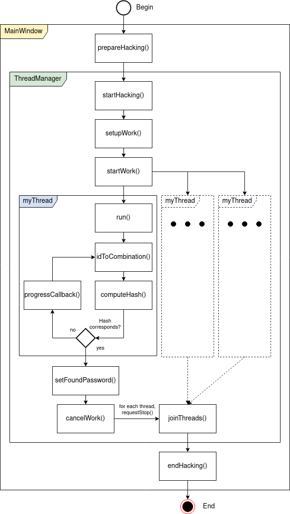

# HEIG_PCO_Labo02

**Authors**: Aubry Mangold, Timothée Van Hove

**Date**: 17.10.2023

## Introduction

We are interested in developing a program capable of cracking an md5 hash to recover a password. An application has been provided to us, but suffers from some performance shortcomings, as it is single-threaded. So the goal of this lab is to enhance the performance of the application by implementing a multi-threaded process.

## How to speed-up the hacking process?

It is evident that the program primary function is to evaluate every possible combinations. This, being a computationally heavy task, we can leverage concurrency to speed-up the process by allowing simultaneous evaluation of distinct combinations.

### Partitioning Strategy

In order to multi-thread the workload, we must implement a good partitioning startegy. Every thread must have a fraction of the workload to compute.

**Our solution**: The total workload, which is the entire space of combinations, is divided into distinct segments. This approach is chosen over dynamic allocation because it reduces overhead. Each thread is assigned a specific range of combinations to evaluate. This range is determined by a unique identifier, which ensures no two threads work on the same combination, eliminating redundancy and the potential for race conditions.

The `idToCombination` function will then take the partition the thread is assigned to and return every unique combination in this space.The logic behind this function is grounded in the concept of base conversion. Just as we can represent numbers in base-10 or base-16, the function represents numbers in a base equivalent to the size of the charset. This ensures that every unique ID corresponds to a unique combination of characters, making the process efficient for brute-forcing.

### Communication and Feedback

While the tasks are separate, it is crucial to maintain a communication channel to the main thread. As soon as a thread finds the correct combination, it need to relay this information to prevent other threads from continuing redundant computations. 

**Our solution**: 

1. We use an atomic global flag that is checked by all threads. The flag serves as an immediate signaling mechanism. Other threads, in  the course of their execution, check this flag before processing another chunk of combinations.
2. We use an explicit termination with the `cancelWork` function. It provides a means to actively and explicitly instruct other threads to cease their operations.

**Isn't those 2 mechanisms redundant?**

Initially, we though that the explicit termination would suffice. But we observed that without the atomic flag, the overall performance was degraded. So without knowing exactly why, we decided to keep the atomic flag in addition to the explicit termination.

## Workflow

Here is a simplified representation of the workflow:

The execution begins with the `MainWindow` initiating the `prepareHacking()` function, which sets the initial parameters and readies the environment for the upcoming multithreading operations.

The control is then transferred to the `ThreadManager` via the `startHacking()` function. Here, the primary responsibility is to manage and coordinate the multi-threaded operations. Within `ThreadManager`, the `setUpWork()` method is responsible for allocating distinct segments of the task to individual threads, ensuring no overlap or redundancy.

Once the task distribution is complete, the `startWork()` method triggers each thread to execute its assigned operations. The `run()` function is executed, which sequentially goes through the steps of hacking. It starts by generating combinations using `idToCombination()`, followed by the computation of the hash with `computeHash()`.

During this process, if a thread identifies a matching hash, it communicates to the main thread, which subsequently executes the `setFoundPassword()` function, logging the identified password. In the event a match isn't found within an iteration, the `progressCallback()` method is utilized to relay the status to the `ThreadManager`.

Post-completion of tasks by the threads or upon successful identification of the hash, the `ThreadManager` invokes the `cancelWork()` function for all active threads, instructing them to terminate their operations. This is immediately followed by the `joinThreads()` function, ensuring that all the threads conclude and system resources are released.

The process is finalized with the `endHacking()` function, which handles any necessary post-operation tasks and concludes the overall workflow. The design emphasis is on efficient distribution of tasks across threads, real-time monitoring, and structured resource management.

## From Work Stealing to Partitioning

In our preliminary design, we employed the "work stealing" strategy, where each thread would fetch a new chunk of work from a shared queue upon completing its segment. To facilitate this, the combination space was fragmented into smaller units, all stored within a concurrency-safe queue accessible by all threads.

However, on close analysis, we concluded that the efficiency gains from this method were minimal, amounting to about 10-20 ms speed-up for a 4-character password. Given this performance enhancement and the complexities introduced by ensuring thread-safe access to the shared queue using mutexes, it became evident that the benefits did not justify the added complexity.

That's why, we decided to implement the more straightforward partitioning strategy.

## Performance tests

The performance of the hash cracker is measured on a 4 character salted password and with a different number of threads. The salt used throughout the tests is `pco23`.
The tests were performed on a 8-core AMD Ryzen 7 PRO 6850U CPU (Machine 1) and on a 4-core Intel Core i7-10510U CPU (Machine 2).

### Middle of the search space
The difficulty lies in the fact that the password must be situated in the middle of the search space for results to be meaningful.
Since the search space is split in equal parts depending on the number of threads, the combination in the middle of the search space is not necessarily in the middle of the search space of each thread. A python script was used to find the password in the middle of the search space of each thread. The script is available in the root folder.

The following permutations indices were used to generate the hashes depending on the number of threads:

| Number of threads | Permutation index | Salted hash                      |
|-------------------|-------------------|----------------------------------|
| 1                 | 9487368           | 242164efb8d1aeea6bd78b5ae5066cfd |
| 2                 | 4743684           | b08c257e8d52e04be4af94f85022c760 |
| 4                 | 2371842           | 1203fea68fa935aaa742147ac62e9892 |
| 8                 | 1185921           | 249a2cd75b430753351bf0edd7c837cd |
| 16                | 592960            | 0b5bcb75de079a1389cb1a7db0fcb9bf |
| 32                | 296480            | 9dab8af4e8b4e02232f6a5a784fe252a |

Running the brute force program with the thread/hash pairs produces the following results:

| Number of threads | Time (ms) |
|-------------------|-----------|
| 1                 | 2612      |
| 2                 | 1368      |
| 4                 | 730       |
| 8                 | 423       |
| 16                | 399       |
| 32                | 396       |

### Beginning and end the search space
For good measure, the tests have also been run on the first and last permutations of the alphabet (namely `aaaa` and `****`). The following hashes were used:

| Position  | Salted hash                      |
|-----------|----------------------------------|
| Beginning | 518f6663077103d3242cf0d537da17c8 |
| End       | 635e25bf87af5d325eff6806bd405f5c |

The results for a password situated at the beginning of the search space are as follows:

| Number of threads | Time (ms) |
|-------------------|-----------|
| 1                 | 0         |
| 2                 | 0         |
| 4                 | 0         |
| 8                 | 0         |
| 16                | 1         |
| 32                | 2         |

The results for a password situated the end of the search space are as follows:

| Number of threads | Time (ms) |
|-------------------|-----------|
| 1                 | 5314      |
| 2                 | 2886      |
| 4                 | 1558      |
| 8                 | 910       |
| 16                | 852       |
| 32                | 916       |

TODO: should we test with passwords situated __almost__ at the beginning/end of the search space?

## Tested scenarios

All the scenarios below have been checked:

- [x] The application must find the original password and notify the user
- [x] If the password is not found the application must notify the user
- [x] The multi-threaded application must be faster than the original single-threaded one
- [x] The application must not crash if the password length, or the hash value are erroneous
- [x] The status bar must report the progress

