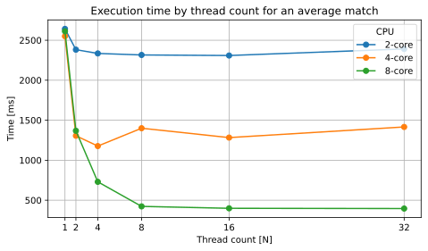
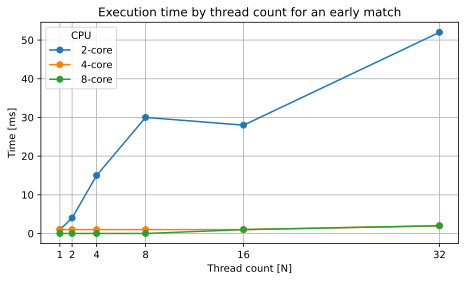
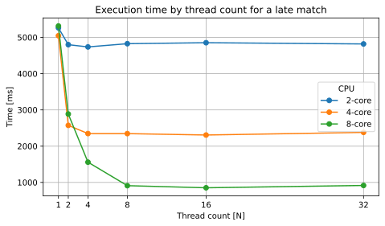

# HEIG_PCO_Labo02

**Authors**: Aubry Mangold, Timothée Van Hove

**Date**: 17.10.2023

## Introduction

We are interested in developing a program capable of finding Md5 hash primitives. A single-threaded application skeleton
was
provided to us but suffers from performance shortcomings. The goal of this laboratory is to
enhance the performance of the application by implementing a multithreaded process.

## Performance gains

The program's primary function is to hash every possible combinations of an alphabet and compare it to the provided
hash.
This CPU-intensive task can leverage concurrency to speed up the process by allowing for the simultaneous evaluation of
distinct combinations.

### 2.1 Search space partitioning

In order to multi-thread the workload, we must implement a judicious partitioning strategy. Every thread must have a
fraction
of the workload to compute.

The total workload, which is the entire space of combinations, is divided into distinct segments. This
approach is chosen over dynamic allocation because it reduces overhead. Each thread is assigned a specific range of
combinations to evaluate. This range is determined by a unique identifier, which ensures no two threads work on the same
combination, eliminating redundancy and the potential for race conditions.

The `idToCombination` function will then take the partition the thread is assigned to and return every unique
combination in this space. The logic behind this function is grounded in the concept of base conversion. Just as we can
represent numbers in base-10 or base-16, the function represents numbers in a base equivalent to the size of the
charset. This ensures that every unique identifier corresponds to a unique combination of characters, making the process
efficient for brute-forcing.

### 2.2 Communication and Feedback

While the tasks are separated, it is crucial to maintain a communication channel with the main thread. As soon as a
thread
finds the correct combination, it needs to relay this information to prevent other threads from continuing redundant
computations. The chosen solutions are the following :

1. Use an atomic global flag that is checked by all threads. The flag serves as an immediate signaling mechanism.
   Other threads, in the course of their execution, check this flag before processing another chunk of combinations.
2. Use an explicit termination with the `cancelWork` function. It provides a means to actively and explicitly
   instruct other threads to cease their operations.

The initial postulate was that the explicit termination would suffice. We nonetheless observed that without the atomic
flag, the
overall performance degraded. In the end, we decided to keep the atomic flag and the explicit termination even
though we do not yet fully understand which mechanisms are at play. A solution that would be worth exploring is to use
a profiler to understand the performance impact of each of these mechanisms. We regretfully did not have the time to
pursue this avenue.

### 2.3 Progress reporting

The progress reporting is handled by the `ThreadManager` class which provides a callback function to the threads. Each
time a thread has done 1% of its work, it calls the callback function, which in turn raises a signal to increment the
progress bar in the `MainWindow` class. The threads are provided with a value indicating the number of combinations to
hash before making a callback.

## Workflow

The following diagram shows the workflow of the program:

The execution begins with the `MainWindow` initiating the `prepareHacking()` function, which sets the initial parameters
and readies the environment for the upcoming multithreading operations.

The control is then transferred to the `ThreadManager` class via the `startHacking()` method. The primary
responsibility of the class is to manage and coordinate the threaded operations. Within `ThreadManager`,
the `setupWork()`
method is responsible for splitting the work into as many chunks as there are threads, ensuring no overlap or
redundancy. The rationale behind this approach is to minimize amount of work that must be done by the threads
themselves,
so they can focus on the primary task of computing the hash.

Once the task splitting is complete, the `startWork()` method creates parametrized threads to execute its assigned
operations. The `run()` function is executed, which sequentially goes through the steps of hacking. It starts by
generating combinations using `idToCombination()`, followed by the computation of the hash with `computeHash()`.

During this process, if a thread identifies a hash primitive, it sets the atomic flag to `true` and uses the
provided `setFoundPassword()` callback to communicate the found password to the `ThreadManager` class.

Post-completion of tasks by the threads or upon successful identification of the hash, the `ThreadManager` invokes
the `cancelWork()` function for all active threads, instructing them to terminate their operations. This is immediately
followed by the `joinThreads()` function, ensuring that all the threads conclude and system resources are released.

The process is finalized with the `endHacking()` function, which handles any necessary post-operation tasks and
concludes the overall workflow. The design emphasis is on efficient distribution of tasks across threads, real-time
monitoring, and structured resource management.

## From Work Stealing to Partitioning

In our preliminary design, we employed the "work stealing" strategy, where each thread would fetch a new chunk of work
from a shared queue upon completing its segment. To facilitate this, the combination space was fragmented into smaller
units, all stored within a concurrency-safe queue accessible by all threads.

However, on close analysis of our specific case, we concluded that the efficiency gains from this method were minimal,
amounting to only about 10-20 ms speed-up for a 4-character password. Given this performance enhancement and the
complexities introduced by ensuring thread-safe access to the shared queue using mutexes, it became evident that the
benefits did not justify the added complexity.

We hence decided to implement the more straightforward partitioning strategy which was presented earlier in this report.

## 5. Performance tests

The performance of the hash cracker is measured on a 4 character salted password and with a different number of threads.
The salt used throughout the tests is `pco23`.
The tests were performed on a 16-core AMD Ryzen 7 PRO 6850U CPU with the amount of cores artificially limited to 2, 4 or
8 using the `taskset` program. All recorded times are in milliseconds. All tests were ran using a salted password since
we did not observe any significant difference in performance between salted and unsalted passwords.
The benchmarks were ran with the hash primitive situated at the beginning, middle and end of the search space in order
to get a better idea of the performance of the program.

### Middle of the search space

In this case, the difficulty lies in the fact that the password must be situated in the middle of the search space for
the results to be meaningful.
Since the search space is split in equal parts depending on the number of threads, the combination in the middle of the
search space is not necessarily in the middle of the search space of each thread. A python script was used to find the
combination in the middle of the search space of each thread.

The following permutations indices were used to generate the hashes depending on the number of threads:

| Number of threads | Permutation index | Salted hash                      |
|-------------------|-------------------|----------------------------------|
| 1                 | 9487368           | 242164efb8d1aeea6bd78b5ae5066cfd |
| 2                 | 4743684           | b08c257e8d52e04be4af94f85022c760 |
| 4                 | 2371842           | 1203fea68fa935aaa742147ac62e9892 |
| 8                 | 1185921           | 249a2cd75b430753351bf0edd7c837cd |
| 16                | 592960            | 0b5bcb75de079a1389cb1a7db0fcb9bf |
| 32                | 296480            | 9dab8af4e8b4e02232f6a5a784fe252a |

Running the brute force program with the aforementioned thread count/hash combinations produces the following results:

| Number of threads | Time (ms) with 2 cores | Time (ms) with 4 cores | Time (ms) with 8 cores |
|-------------------|------------------------|------------------------|------------------------|
| 1                 | 2642                   | 2550                   | 2612                   |
| 2                 | 2382                   | 1306                   | 1368                   |
| 4                 | 2335                   | 1177                   | 730                    |
| 8                 | 2316                   | 1400                   | 423                    |
| 16                | 2309                   | 1283                   | 399                    |
| 32                | 2391                   | 1416                   | 396                    |

### Beginning of the search space

Testing was done using the first hash of the search space in order to get data for the warm-up time of the program. The
following hash was used:

| Position  | Permutation index | Salted hash                      |
|-----------|-------------------|----------------------------------|
| Beginning | 1                 | 518f6663077103d3242cf0d537da17c8 |

The results for a password situated at the beginning of the search space are as follows:

| Number of threads | Time (ms) with 2 cores | Time (ms) with 4 cores | Time (ms) with 8 cores |
|-------------------|------------------------|------------------------|------------------------|
| 1                 | 1                      | 1                      | 0                      |
| 2                 | 4                      | 1                      | 0                      |
| 4                 | 15                     | 1                      | 0                      |
| 8                 | 30                     | 1                      | 0                      |
| 16                | 28                     | 1                      | 1                      |
| 32                | 52                     | 2                      | 2                      |

### End of the search space

Tests were also ran on the last hash of the search space in order to get data for worst possible case for the program.
The following hash was used:

| Position | Permutation index | Salted hash                      |
|----------|-------------------|----------------------------------|
| End      | 18974736          | 635e25bf87af5d325eff6806bd405f5c |

The results for a password situated the end of the search space are as follows:

| Number of threads | Time (ms) with 2 cores | Time (ms) with 4 cores | Time (ms) with 8 cores |
|-------------------|------------------------|------------------------|------------------------|
| 1                 | 5262                   | 5046                   | 5314                   |
| 2                 | 4799                   | 2573                   | 2886                   |
| 4                 | 4737                   | 2347                   | 1558                   |
| 8                 | 4826                   | 2346                   | 910                    |
| 16                | 4853                   | 2307                   | 852                    |
| 32                | 4819                   | 2380                   | 916                    |

## Tests

All the following cases have been manually checked:

- [x] The application must find the original password and notify the user
- [x] If the password is not found the application must notify the user
- [x] The multithreaded application must be faster than the original single-threaded one
- [x] The application must not crash if the password length or the hash value are erroneous
- [x] The status bar must report the progress

## Conclusion

The results of the tests indicate a tendency for the program to hit its execution speed cap when the number of threads
is equal to the number of cores.
This is due to the fact that the performance of the program is strictly CPU bound and that the once the number of
threads is equal to the number of cores,
the scheduler has to give time to multiple threads on a single core. Hence, adding more threads will only reduce the
performance of the program.

The results for a match at the very beginning of the search space also indicate that the program start-up time is
negligible compared to the execution time of the brute-force loop. Interestingly, the program start-up is considerably
slower when more threads are used. This is due to the overhead cost of creating new threads as well as the eventual
preemption that may happen at the very beginning of the program.

Although the experiment gives us a good idea of the performance of the program, it is not a perfect representation of
the performance of the program due to the lack of repetitions in the tests. This lack of repetition means that the
results
are not statistically significant. For proper testing, a bigger series of tests should be run in order to follow
the [Law of large numbers](https://en.wikipedia.org/wiki/Law_of_large_numbers).

